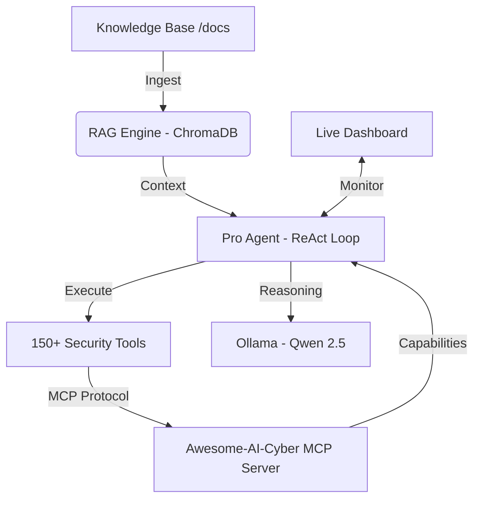

# Awesome-AI-Cyber | Professional Security Intelligence & Automation 🛡️🤖

Welcome to **Awesome-AI-Cyber**, a state-of-the-art autonomous penetration testing platform. This platform integrates a sophisticated Knowledge Layer (RAG), a standardized Connection Layer (MCP), and an autonomous Execution Layer (AI Agents) to provide end-to-end security assessments.

---

## 🏛️ System Architecture

The platform follows a modular architecture designed for scalability, privacy, and precision:



---

## 📋 Prerequisites

Before deploying Awesome-AI-Cyber, ensure your environment meets the following requirements:
- **Docker & Docker Compose**: For containerized services.
- **Python 3.10+**: For running the agents and ingestion engine.
- **Ollama**: (Optional but recommended) For local LLM acceleration.
- **Memory**: Minimum 16GB RAM recommended for running 7B models.

---

## 🚀 Deployment Guide

### 1. Infrastructure Setup
Initialize the core services (Database, LLM, and Security Server):

```powershell
docker-compose up -d
```

### 2. Environment Preparation
Ensure all required AI models are pulled inside the containerized environment:

```powershell
# Reasoning Model
docker exec awesome_ai_cyber_ollama ollama pull qwen2.5:7b

# Embedding Model (for Knowledge)
docker exec awesome_ai_cyber_ollama ollama pull nomic-embed-text
```

### 3. Local Dependencies
Install the Python orchestration layer:

```powershell
pip install -r Awesome-AI-Cyber/requirements.txt
```

---

## 🧠 Knowledge Layer Management (RAG)

The Knowledge Layer allows the agent to "read" your security manuals, CVE reports, or corporate policies.

### Ingestion Workflow
1.  Place your `.md`, `.txt`, or `.pdf` files in the `knowledge_base/` directory.
2.  Run the ingestion engine to index the documents:
    ```powershell
    python rag_engine.py --ingest
    ```
3.  The engine will convert text into vector embeddings and store them in **ChromaDB**.

---

## 🕹️ Operation Modes

### Mode A: Autonomous Pro Agent (Recommended)
The **Pro Agent** uses a ReAct (Reasoning + Acting) loop. It analyzes the target, retrieves relevant knowledge from the RAG, and executes tools via MCP.

```powershell
python agent_pro.py <TARGET_URL>
```
*Example: `python agent_pro.py http://testphp.vulnweb.com`*

### Mode B: Manual Tool Invocation
For specific tasks without AI orchestration, use the `call_awesome_ai_cyber.py` CLI:

```powershell
# List available tools
python call_awesome_ai_cyber.py --list

# Execute a manual Nmap scan via Awesome-AI-Cyber
python call_awesome_ai_cyber.py nmap --params '{"target": "127.0.0.1", "scan_type": "-F"}'
```

---

## 📊 Monitoring & Visibility

### Real-Time Dashboard
Open `dashboard.html` in any modern browser to view the live mission control:
- **Intelligence Feed**: Real-time logs from the agent and tools.
- **Agent Mindset**: See exactly what the AI is thinking and why it chooses certain tools.
- **Vulnerability Alerts**: Immediate notification of discovered security flaws.
- **RAG Hits**: Monitor which documents the agent is consulting.

---

## 🛠️ Components Reference

| Component | File | Description |
| :--- | :--- | :--- |
| **Pro Agent** | `agent_pro.py` | The main autonomous engine. |
| **RAG Engine** | `rag_engine.py` | Manages document indexing and retrieval. |
| **MCP Server** | `Awesome-AI-Cyber/hexstrike_mcp.py` | Standardized bridge for 150+ tools. |
| **Core Server** | `Dockerfile.awesome_ai_cyber` | Containerized Kali Linux with full security arsenal. |
| **Vector DB** | `docker-compose.yml` | ChromaDB persistence layer. |

---

## ⚠️ Troubleshooting & FAQ

**Q: Agent reports "Model Not Found" (404)**
**A:** Ensure you have run the `docker exec` pull commands listed in the Deployment Guide.

**Q: Connection Refused on port 8888**
**A:** Check if the `awesome_ai_cyber_server` container is running: `docker ps`.

**Q: Large file push errors (GitHub)**
**A:** This project uses `.gitignore` to exclude large model files. Ensure you do not manually add `ollama_data/` or `chroma_data/` to your commits.

---

## 🛡️ Legal Disclaimer
*This tool is for educational and authorized professional security testing only. Unauthorized use against targets without consent is illegal.*